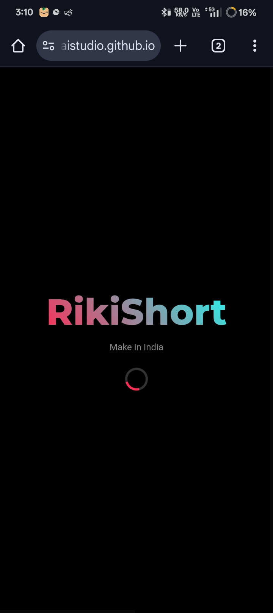
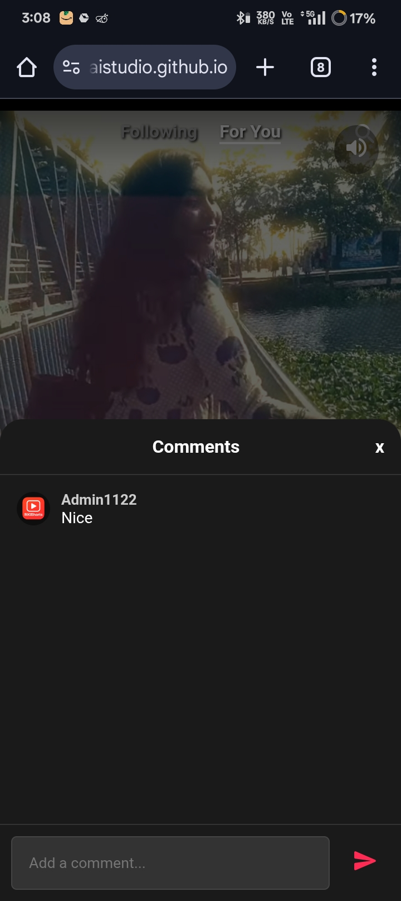
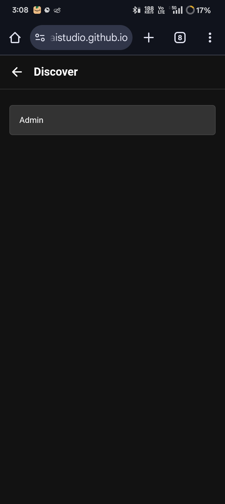
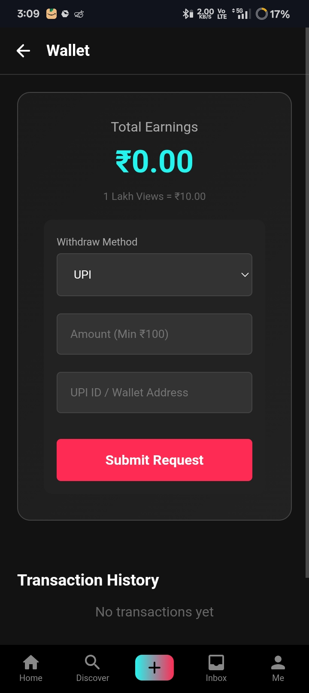
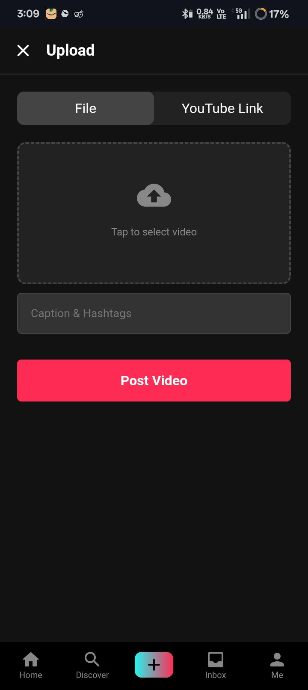

<div align="center">

  

  <h1>🇮🇳 Made in India - Short Video Platform</h1>
  
  <p>
    <b>RikiShort</b> is a feature-rich short video application allowing users to create, share, and monetize their content. Built with modern web technologies for a seamless experience.
  </p>

  <!-- BUTTONS SECTION -->
  <a href="YOUR_APK_DOWNLOAD_LINK_HERE">
    
  </a>
  &nbsp;&nbsp;
  <a href="YOUR_WEBSITE_LINK_HERE">
    
  </a>

</div>

<br><br>

<!-- SCREENSHOTS GALLERY -->
## 📸 App Screenshots
Here is a glimpse of the **RikiShort** user interface:

<div align="center">
  <table>
    <tr>
      <td align="center"><b>Splash Screen</b></td>
      <td align="center"><b>Video Feed</b></td>
      <td align="center"><b>Comments & Social</b></td>
    </tr>
    <tr>
      <td></td>
      <td></td>
      <td></td>
    </tr>
    <tr>
      <td align="center"><b>Discover & Search</b></td>
      <td align="center"><b>Wallet & Earnings</b></td>
      <td align="center"><b>Easy Upload</b></td>
    </tr>
    <tr>
      <td></td>
      <td></td>
      <td></td>
    </tr>
  </table>
</div>

<br>

## ✨ Key Features

| Feature | Description |
| :--- | :--- |
| 🎥 **Infinite Feed** | Smooth scrolling vertical video feed (TikTok style). |
| 💰 **Monetization** | Earn money per view! (₹10.00 per 1 Lakh views). |
| 📤 **Smart Upload** | Upload from device OR paste YouTube/Shorts links directly. |
| 🔒 **Authentication** | Secure Login & Signup via Firebase Auth. |
| ✅ **Verification** | Verified Badge system for authentic creators. |
| 💳 **Wallet System** | Withdraw earnings via UPI, USDT, or Bank Transfer. |
| ❤️ **Interactions** | Like, Comment, Share, and Follow functionality. |

<br>

## 🛠️ Tech Stack

*   **Frontend:** HTML5, CSS3, Vanilla JavaScript (SPA Architecture)
*   **Backend / Database:** Firebase Realtime Database
*   **Authentication:** Firebase Auth
*   **Storage:** Cloudinary (Video), ImgBB (Images)
*   **Hosting:** GitHub Pages / Firebase Hosting

<br>

## 🚀 How to Run

1.  Clone the repository:
    ```bash
    git clone https://github.com/YOUR_USERNAME/RikiShort.git
    ```
2.  Open `index.html` in your browser.
3.  Enjoy the app!

<br>

<div align="center">
  <h3>📬 Support</h3>
  <p>For any queries or support, contact us at: <b>nitai.grp00@gmail.com</b></p>
  <p>© 2025 RikiShort. All Rights Reserved.</p>
</div>
